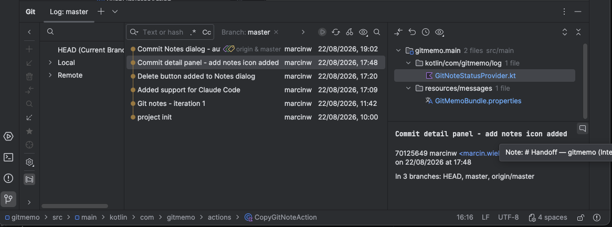
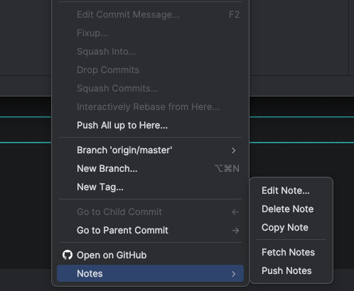
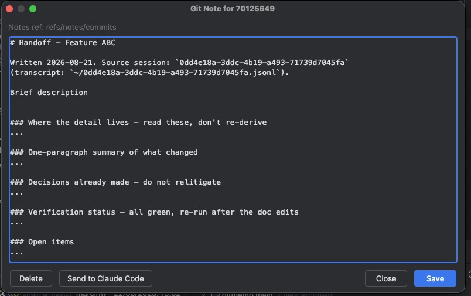

# gitmemo

An IntelliJ Platform plugin that brings **git notes** into the VCS Log along with Claude Code terminal integration.


## Why

Git notes live outside the commit object graph, so the bundled Git plugin does not surface them at
all in the IDE by default.

Using Git Notes you can address a common problem in AI-assisted development: when an AI agent produces a commit, the conversation that led to that change is typically lost. Team members see what changed but not why the AI was asked to change it, what alternatives were considered, or what constraints were given.

The session transcript or handoff notes can be stored against a commit and easily resumed later or shared with other teammates.
Useful for managing context in AI assisted development environment and keeping an audit trail for automated workflows.

## Features

**Note indicator in the commit details panel.** The balloon icon marks an annotated commit; hovering
it previews the note.



**Notes group in the Log context menu.** Right-click a commit → **Notes**.



**Note editor.** Shows the active notes ref, with *Send to Claude Code* alongside the usual save and
delete actions.



## Requirements

- A **local** `git` executable 
- The Terminal plugin — only for the *Send to Claude Code* button

## Install

The plugin is not on the Marketplace yet, so build it from source:

```bash
./gradlew buildPlugin
# → build/distributions/gitmemo-<version>.zip
```

Then in the IDE: **Settings → Plugins → ⚙ → Install Plugin from Disk…** and pick the zip.

## Usage

**Sharing notes.** *Fetch Notes* and *Push Notes* sync `refs/notes/*` with a remote — `origin` if it
exists, otherwise the first configured remote. Note that this covers **every** notes namespace, not
just the one configured in settings. The fetch is forced, because note refs legitimately move
non-fast-forward; the push is not.

## Settings

**Settings → Version Control → Git Notes** has a single option, *Notes ref* — the namespace passed to
`git notes --ref`. It defaults to git's own default, `refs/notes/commits`, and is stored per project.

## Send to Claude Code

The note editor has a *Send to Claude Code* button when the Terminal plugin is available. The Claude
Code plugin itself is not required.

What it does, precisely:

1. Finds a running Claude Code session — the most recent `Claude Code` terminal tab, or a terminal
   whose shell process (or one of its children) is `claude`. If there is none, it starts one and waits
   up to 60 seconds for the session to come up.
2. Types the note into the prompt as a bracketed-paste block, so a multi-line note arrives as one
   message instead of being submitted line by line, and focuses the terminal.
3. Closes the dialog **without saving**.

The message is just the note, with a one-line header naming the commit and the notes ref:

```
Git note on commit <shortHash> (ref <notesRef>):

<note body>
```

Two things worth knowing: the plugin **never presses Enter** — the text sits in the prompt so you can
add to it or discard it — and since the dialog closes without saving, save the note first if you want
to keep it.

## Make notes survive amend and rebase

Git can carry notes over to rewritten commits, but it is off by default. Configure it once:

```bash
git config --global notes.rewriteRef 'refs/notes/*'
git config --global notes.rewriteMode concatenate
git config --global notes.rewrite.amend true
git config --global notes.rewrite.rebase true
```

Verify with:

```bash
git config --global --get-regexp '^notes\.'
```

`notes.rewriteRef` is the switch that actually enables rewriting — it has **no default value**, so
without it the other three settings do nothing. It can be overridden for a single command with the
`GIT_NOTES_REWRITE_REF` environment variable. Use `--local` instead of `--global` to scope the config
to one repository.

## Limitations

- **Local git only.** `git notes` runs as a direct subprocess, so git executables reached through WSL
  or Docker are not supported.
- Fetch and push move all of `refs/notes/*`, not only the configured ref.

## Development

```bash
./gradlew runIde        # launch a sandbox IDE with the plugin (also the "Run IDE with Plugin" run config)
./gradlew buildPlugin   # produce the installable zip
./gradlew verifyPlugin  # run the JetBrains plugin verifier
```

The sandbox provisions the real Claude Code plugin, so the terminal hand-off can be exercised
end-to-end during development. It is a sandbox-only dependency — nothing in this plugin compiles
against it.
